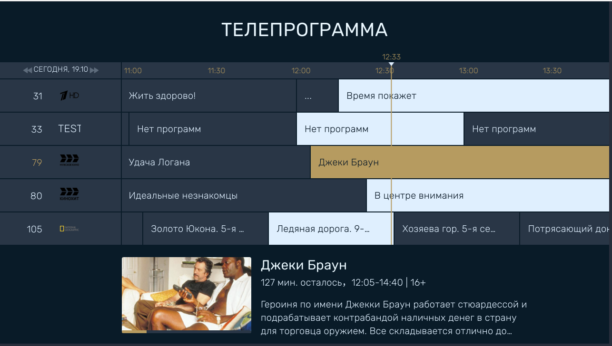

# Тестовое задание

Нужно сделать телепрограмму, как на приложенной картинке.

В репозитории скелет приложения.
Можно менять всё, кроме `query.service.ts` -
если его неправильно отредактировать, то поломаются запросы на сервер.
При верстке нужно использвать цвета, определенные в файле `definitions.scss`

## Требования к приложению
EPG должен позволять:

1. Отображение номера канала (номер - это позиция канала в channelDetails,
нумерация начинается с 1), логотипа канала - logo
(если нет логотипа - то название канала name).

2. Прокрутку на 2 суток назад и вперед.
При прокрутке должна меняться дата и строка времени.

3. Отображение и скрытие вертикальной полосы текущего времени.
Полоса должна двигаться при просмотре страницы в соответствии с текущем временем.

4. Отображение программ для канала на выбранное время.
Если программа идет сейчас, она должна быть выделена.
Используется свойство name из ответа сервера.

5. Отображение детальной информации о выбранной передаче.
Используются свойства name, introduce, picture.posters[0] и rating.
Все - при наличии. Например, у передачи может не быть описания,
и/или постера, и/или возрастного рейтинга.

6. Прокрутка по вертикали - чтобы можно было посмотреть все каналы.

7. Навигация по горизонтали и вертикали только с клавиатуры,
стрелками. Мышь не используется вообще.

## Запуск приложения
Приложение работает через Angular CLI: `ng serve`

## Замечание о CORS
Сервер не поддерживает CORS.
Чтобы запросы работали правильно, нужно запустить браузер с отключенной безопасностью.
Это можно сделать для Chrome/Chromium

1. Закрыть все окна браузера.

2. Запустить браузер из командной строки (или изменить ярлык) с параметрами:
`--disable-web-security --user-data-dir -–allow-file-access-from-files --ignore-certificate-errors`

Тогда кросс-доменные запросы заработают.

Пример для Linux:

`/home/user$ chromium-browser --disable-web-security --user-data-dir -–allow-file-access-from-files --ignore-certificate-errors`
